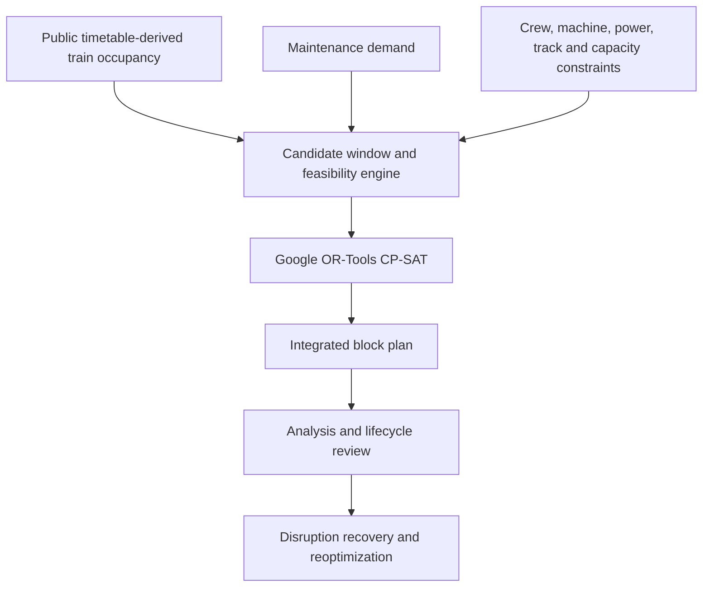
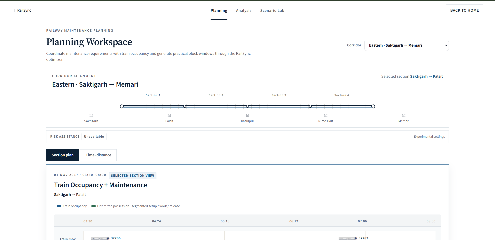
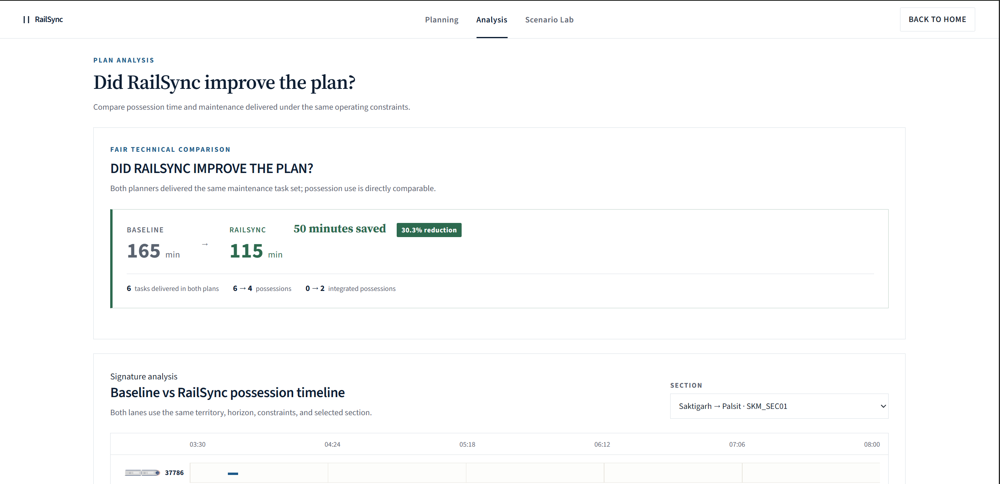
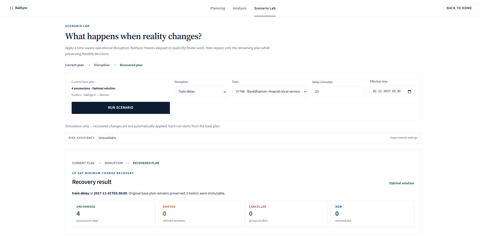

# RailSync

AI-assisted railway maintenance block planning and operational recovery for coordinated Engineering, S&T, and TRD work.

| Submission field | Details |
| --- | --- |
| Project Title | RailSync |
| Team Name | RailSync |
| PS ID | SIH26027 |
| PS Title | AI-Powered Automatic Block Planning to Maximize Asset Availability for Train Operations on Indian Railways |
| Category | Software |
| Theme | Transportation & Logistics |
| Live Prototype | [rail-sync-eosin.vercel.app](https://rail-sync-eosin.vercel.app) |

## Problem Statement

Railway maintenance needs safe access to infrastructure without unnecessarily disrupting train operations. Engineering, Signalling & Telecommunication (S&T), and Traction Distribution (TRD) work may compete for the same corridor while depending on section and track capacity, crews, machines, power isolation, train movements, deadlines, task priority, and setup/release time.

A gap visible in a timetable is therefore only a starting point. It may be unusable once operational constraints are considered, or it may be better used as one shared possession for compatible work.

## Proposed Solution

RailSync combines public timetable-derived train occupancy with prototype maintenance demand and resource context. It builds candidate windows, checks operational feasibility, and uses Google OR-Tools CP-SAT to produce coordinated maintenance possessions. The resulting plan can be compared with a non-integrated baseline, reviewed through diagnostics, and repaired when an operational disruption changes the remaining work.

> **An empty timetable gap is not necessarily an available block.**

RailSync evaluates the relevant constraints together before treating a window as practically available.

## How RailSync Works



## Key Features

### Planning & Optimization

- Multi-territory planning, directional tracks, multi-section work, and candidate maintenance windows
- Constraint-based CP-SAT scheduling and compatible Engineering, S&T, and TRD work in shared possessions
- Planning workspace with section and time-distance views and solver-backed alternatives

### Operational Constraints

- Train movement conflicts and section/capacity footprints
- Crew and machine availability, power isolation windows, setup/release allowances, deadlines, criticality, and urgency

### Analysis & Explainability

- Non-integrated baseline versus RailSync comparison under the same planning context
- Feasibility diagnostics, integration reasons, outstanding-work analysis, alerts, and resource views
- CSV export and print/PDF-ready browser reporting

### Scenario Recovery

- Time-aware recovery for single or multiple train delays, crew or machine unavailability, power-isolation cancellation, section unavailability, weather restrictions, and emergency maintenance
- Minimum-change reoptimization that preserves elapsed or explicitly frozen work

### Planning Lifecycle

- Prototype plan states from Draft through Reviewed, Approved, and Published
- Block lifecycle controls, plan history, rolling monthly/weekly/day-of views, and explicit apply actions
- Lifecycle state is held in application memory and is not persistent across backend restarts

### Data & Provenance

- Registered territory snapshots with documented timetable evidence, assumptions, and synthetic prototype inputs
- Optional ML-assisted delay-risk scoring when the frozen model/profile binding is available; CP-SAT remains the scheduling authority

## Technology Stack

| Layer | Technologies |
| --- | --- |
| Frontend | React 19, Vite 8, Framer Motion 13 |
| Backend | Python, FastAPI, Pydantic, Uvicorn |
| Optimization | Google OR-Tools CP-SAT |
| Optional risk support | scikit-learn model training/inference artifacts |
| Testing and tooling | pytest, Node.js built-in test runner, oxlint |
| Deployment | Vercel frontend, Render backend |

No application database is currently used.

## System Architecture

The React client calls a FastAPI API through the relative `/api` path. Backend planning, operational, and recovery services load registered territory inputs, call the feasibility/resource layers and CP-SAT optimizer, and return plan, analysis, lifecycle, or recovery results. See [System Architecture](docs/architecture.md) for the component and data flow.

## Planning Territories

- **Northern HDN · New Delhi–Palwal**
- **Public Timetable Demo · Saktigarh → Memari**
- **Western HDN · Virar–Dahanu Road**

These are frozen, public/historical timetable-derived decision-support snapshots—not live railway feeds. Maintenance demand, resource context, and disruption scenarios are synthetic prototype inputs where internal operational data is unavailable. RailSync is not connected to an Indian Railways production system; see [Data Provenance](docs/DATA_PROVENANCE.md).

## Working Prototype / Screenshots

### Planning Workspace



### Analysis



### Scenario Lab



The landing-page capture and descriptions for all included images are in the [screenshot index](assets/screenshots/README.md).

## Live Demo

Open the working prototype at [https://rail-sync-eosin.vercel.app](https://rail-sync-eosin.vercel.app). A reviewer walkthrough is available in [submission/DEMO.md](submission/DEMO.md).

## Repository Structure

```text
RailSync/
├── frontend/             React + Vite application
├── backend/              FastAPI routes, schemas, and application services
├── optimizer/            Candidate windows, feasibility, resources, CP-SAT, and recovery
├── data/                 Territory registry, adapters, snapshots, scenarios, and validation
├── ml/                   Optional offline delay-risk training and inference support
├── models/               Frozen model artifact used by optional risk assistance
├── tests/                Cross-layer Python tests
├── docs/                 Architecture, assumptions, provenance, ML, and recovery notes
├── assets/screenshots/   Evaluator-facing prototype captures
├── submission/           Final presentation and demo notes
├── CONTRACTS.md          Data and API contracts
└── PROJECT_SPEC.md       Detailed project specification
```

## Installation / Running Locally

Prerequisites: a Python environment compatible with `backend/requirements.txt` and a current Node.js/npm installation.

From the repository root, create/activate a Python environment, then install the backend requirements and start FastAPI:

```powershell
python -m pip install -r backend/requirements.txt
python -m uvicorn backend.main:app
```

In another terminal:

```powershell
cd frontend
npm install
npm run dev
```

Open `http://localhost:5173`. During local development, Vite proxies relative `/api` requests to FastAPI at `http://127.0.0.1:8000`. The frontend environment convention is `VITE_API_BASE_URL=/api`.

## Verification / Tests

From the repository root:

```powershell
python -m data.validate_data
python -m pytest -q -p no:cacheprovider
cd frontend
npm test -- --run
npm run lint
npm run build
```

## Data & Assumptions

RailSync keeps input limitations explicit. Read [Assumptions](docs/ASSUMPTIONS.md) for modeling boundaries and [Data Provenance](docs/DATA_PROVENANCE.md) for the origin and classification of each demonstration input.

## Documentation

- [System Architecture](docs/architecture.md)
- [Project Specification](PROJECT_SPEC.md)
- [Contracts](CONTRACTS.md)
- [Assumptions](docs/ASSUMPTIONS.md)
- [Data Provenance](docs/DATA_PROVENANCE.md)
- [ML Risk Model](docs/ML_RISK_MODEL.md)
- [Reoptimization Semantics](docs/REOPTIMIZATION.md)
- [Presentation](submission/PRESENTATION.md)
- [Submission Guide](SUBMISSION_GUIDE.md)

## Expected Impact

RailSync is intended to improve coordination across maintenance departments, reduce fragmented possessions, make better use of infrastructure availability, shorten disruption-recovery planning, and make plan decisions more transparent. Any numeric result shown in the prototype is the output of its named demonstration scenario, not a general production-performance claim.

## Future Scope

- Authenticated railway users and role-based access control
- Persistent operational database, audit history, and plan version storage
- Official railway operational data interfaces and integration with existing planning systems
- Larger network-scale and longer-horizon optimization
- Richer predictive risk models trained on authorized operational data

## Team

Team name: **RailSync**

| Team Member | Role |
|-------------|------|
| To be provided | To be provided |

Member names and roles must be supplied by the team before final submission.
