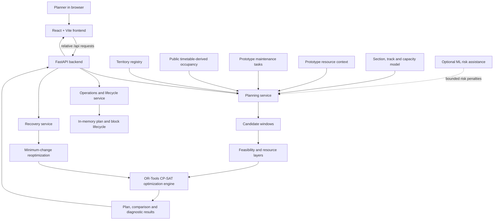

# RailSync System Architecture

RailSync is a browser-based decision-support prototype. It separates the evaluator-facing interface, HTTP application services, registered planning inputs, feasibility logic, optimization, and optional risk assistance. It does not use a database, message queue, or authentication service.

## Component Flow

## Frontend

The React application provides three connected workspaces:

- **Planning** selects a registered territory, shows its corridor and train occupancy, runs the optimizer, presents maintenance possessions, exposes resource and alert views, and supports lifecycle/export actions.
- **Analysis** compares the non-integrated baseline and RailSync plan under the same operating context, including possession metrics, paired timelines, integration gains, diagnostics, and outstanding work.
- **Scenario Lab** applies a synthetic, time-aware disruption to the current plan and displays solver-backed recovery changes. It does not silently apply a recovered plan.

Vite serves the local application and proxies `/api` to `http://127.0.0.1:8000` during development. Production deployment keeps the same relative API convention and is governed by the existing Vercel/Render configuration.

## Backend Services

`backend/main.py` exposes the FastAPI boundary and delegates work to:

- `planning_service.py` for territory loading, request validation, optimization, comparison, metrics, and diagnostics;
- `operations_service.py` for plan and block lifecycle transitions, rolling views, resources, alerts, imports, and exports; and
- `recovery_service.py` for current-plan validation and disruption reoptimization.

Pydantic schemas define the HTTP request and response contracts. The backend returns computed JSON to the frontend; it does not persist operational state externally.

## Planning and Optimization Layers

The `optimizer/` package keeps the domain logic separate from HTTP handling:

1. Candidate-window logic derives possible possession windows around train occupancy.
2. Feasibility, capacity, resource, and compatibility layers evaluate train conflicts, section/capacity footprints, crew and machine limits, power isolation, task deadlines, and integration compatibility.
3. Google OR-Tools CP-SAT selects and groups feasible work using staged planning objectives.
4. Comparison and metrics modules evaluate a non-integrated baseline and the RailSync plan under the same context.
5. Recovery logic protects elapsed or frozen decisions and minimizes change while repairing work affected by a disruption.

## Data Inputs and Honesty Boundary

`data/territories.py` is the registry for selectable territories. JSON snapshot adapters load stations, sections, train occupancy/services, maintenance tasks, timetable evidence, and resource context. Train occupancy is derived from frozen public/historical timetable evidence. Maintenance, resource, and disruption inputs are synthetic prototypes where equivalent internal railway data is not public.

These inputs support reproducible decision-support demonstrations; they are not live feeds and the application is not connected to an Indian Railways production system. Detailed classifications are documented in [Data Provenance](DATA_PROVENANCE.md) and modeling boundaries in [Assumptions](ASSUMPTIONS.md).

## ML Risk Assistance

The `ml/` package contains offline feature preparation, training, and inference for aggregate-delay risk assistance. A frozen artifact may contribute bounded risk penalties only when an explicit historical profile binding is available. If it is unavailable, the system falls back to static planning. CP-SAT—not the ML model—remains the scheduling authority. See [ML Risk Model](ML_RISK_MODEL.md).

## State and Persistence

Plan versions, state transitions, block state, and history are held in module-level in-memory structures in the prototype backend. A backend restart clears them. Persistent storage, authentication, enterprise audit retention, queues, and official operational interfaces are future integration concerns, not current architecture.
